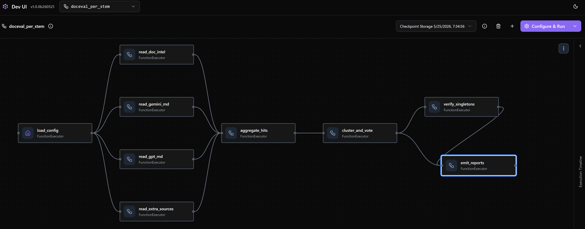
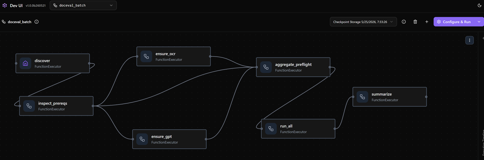
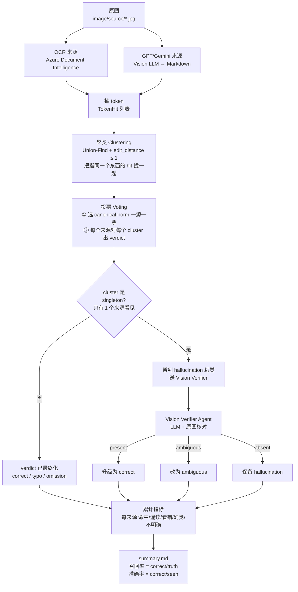

# doceval

**文档 Markdown 抽取质量评估器**——给同一张文档图片找 3 个独立读者（**Azure Document Intelligence OCR**、**Gemini-MD**、**GPT-MD**），让它们交叉对账；任何一方都不当 ground truth。意见不一致的 token 再喂给**视觉大模型**（GPT-5 vision）二次仲裁。最终对每个来源给出 `correct / typo / omission / hallucination / ambiguous` 五分类判定。

> 用一句话说价值：**用模型治模型**——不需要人工标注，就能定位"OCR 把 `B` 看成 `8` / GPT-MD 漏写了表头 / Gemini 编出了一个原图没有的发票号"这类错误。

## 两条 Workflow 一览

整个系统由 [Microsoft Agent Framework `Workflow`](https://github.com/microsoft/agent-framework) 编排（用 `@executor` 节点 + fan-out / fan-in / switch-case 拼图），对外暴露**两条工作流**：

| Workflow | 代码 | 输入 | 输出 | 适用场景 |
|---|---|---|---|---|
| **Per-image**（单图） | [`build_pipeline_workflow`](src/doceval/pipeline/workflow.py) | `stem: str`（如 `"invoice_42"`） | `ImageEvaluation` | 烟测、DevUI 单步调试 |
| **Batch**（批量+前置） | [`build_batch_workflow`](src/doceval/pipeline/batch_workflow.py) | `BatchRequest(stems, sources, concurrency)` | `BatchReport` | 全量回归、跨图汇总 |

两条 workflow 共享同一个**交叉验证内核**：

```
┌───────────────── Cross-verification kernel ─────────────────┐
│                                                              │
│   Azure Doc Intelligence ─┐                                  │
│   (prebuilt-layout, OCR)  │                                  │
│                           │                                  │
│   MD/gemini/<stem>.md ────┼──► Token Pool ──► Clustering ──► │
│   (Gemini 输出的 MD)      │   (统一正则)    (编辑距离 ≤ 1)  │
│                           │                                  │
│   MD/gpt/<stem>.md ───────┘                                  │
│   (GPT 输出的 MD)                                            │
│                                                              │
│            ▼                                                 │
│      Majority vote per cluster                               │
│      • ≥ 2 sources 同意 → 直接定 canonical                   │
│      • 仅 1 source 写出 → 暂记 hallucination，进入下一步     │
│            ▼                                                 │
│      ┌─────────────────────────────────────┐                 │
│      │  Vision verifier (GPT-5 vision)    │                 │
│      │  把可疑 token + 原图发给视觉模型   │                 │
│      │  → present / absent / ambiguous    │                 │
│      └─────────────────────────────────────┘                 │
│            ▼                                                 │
│   Per-source verdict:                                        │
│   correct / typo / omission / hallucination / ambiguous      │
└──────────────────────────────────────────────────────────────┘
```

> **三层交叉验证**：① OCR 看像素 + GPT/Gemini 看文档语义→ 多数票合并；② 单源孤立候选→ 视觉模型仲裁；③ 视觉模型平反后，**其他来源**相应地从 `correct` 改判 `omission`，做到对每个读者都公平归因。

---

### Workflow 1 · Per-image — `build_pipeline_workflow`

跑**一张图**，6 个 superstep。DevUI 里渲染出来是这样的：



**输入**

```python
from doceval.pipeline import build_pipeline_workflow
wf = build_pipeline_workflow()             # 用 .env 里的配置
result = await wf.run("invoice_42")        # stem 就是 image/source/<stem>.jpg 的文件名
```

`stem` 对应磁盘约定：

```
image/source/invoice_42.jpg          ← 原图（必需）
MD/gemini/invoice_42.md              ← Gemini 抽取（可选）
MD/gpt/invoice_42.md                 ← GPT 抽取（可选）
.cache/ocr/invoice_42.<hash>.json    ← Doc Intel 缓存（自动生成）
```

**节点图**（`workflow.py` 里 8 个 `@executor`）

```
                          load_config                       ← step 1：定位原图 + 准备 state
                              │
        ┌─────────────────────┼────── fan-out（4 路并行）──────────────┐
        ▼                     ▼                ▼                       ▼
 read_doc_intel       read_gemini_md     read_gpt_md          read_extra_sources
 (Azure OCR call,     (read MD file)     (read MD file)       (read MD/<other>/)
  cached on disk)
        │                     │                │                       │
        └─────────────────── fan-in (list[ReaderOutput]) ───────────────┘
                              │
                              ▼
                       aggregate_hits                         ← step 3：合并所有 token
                              │
                              ▼
                       cluster_and_vote                       ← step 4：聚簇 + 投票
                              │
            ┌─────────────────┴────────── switch-case ──────────────┐
            ▼ Case: 存在 singleton 待验证               Default ▼
       verify_singletons ──────────────────────────► emit_reports   ← step 6：写文件
       (vision LLM call,                                   │
        only when needed)                                  ▼
                                                    ImageEvaluation
                                                  (yield_output → 外部)
```

**输出**

返回 `ImageEvaluation` 对象 + 落盘三类文件：

```
output/invoice_42/
├── report.md               # 人读：每个簇 + 各来源 verdict + 视觉模型的中文证据
├── clusters.json           # 机读：见下方 schema
└── annotated_<source>.jpg  # 每来源一张，错误位置画色框
```

`clusters.json` 长这样（**示例数字，非真实数据**）：

```jsonc
{
  "stem": "invoice_42",
  "elapsed_s": 18.7,
  "verifier_model": "gpt-5-vision-2026-xx-xx",     // 来自 x-ms-served-model
  "stats": {
    "ocr":    { "correct": 23, "typo": 1, "omission": 0, "hallucination": 4, "ambiguous": 1 },
    "gemini": { "correct": 19, "typo": 1, "omission": 4, "hallucination": 1, "ambiguous": 0 },
    "gpt":    { "correct": 22, "typo": 0, "omission": 2, "hallucination": 0, "ambiguous": 0 }
  },
  "clusters": [
    {
      "canonical": "INV-2024-9999",
      "bbox": [120, 88, 310, 116],
      "sources": ["ocr", "gemini", "gpt"],         // 三家都看到了 → 强 consensus
      "members": [
        { "source": "ocr",    "surface": "INV-2024-9999" },
        { "source": "gemini", "surface": "INV-2024-9999" },
        { "source": "gpt",    "surface": "INV-2024-9999" }
      ]
    },
    {
      "canonical": "8867123",
      "bbox": [205, 410, 312, 438],
      "sources": ["ocr"],                          // 单源 → 触发视觉验证
      "vision_verdict": "present",
      "vision_evidence": "右下方表格第二行可见编号 8867123"
    }
  ],
  "judgements": [
    { "source": "ocr",    "cluster": "INV-2024-9999", "verdict": "correct" },
    { "source": "gemini", "cluster": "8867123",       "verdict": "omission",
      "evidence": "视觉模型确认存在，gemini 未写出" }
  ]
}
```

---

### Workflow 2 · Batch — `build_batch_workflow`

跑**全量 + 自动补数据 + 跨图汇总**，比单图 workflow 多了 **preflight 阶段**——在真正评估之前，并行检查每张图缺什么数据，缺啥补啥。DevUI 渲染效果：



**输入**

```python
from doceval.pipeline import build_batch_workflow
from doceval.pipeline.batch_workflow import BatchRequest

req = BatchRequest(
    stems=[],          # 空 = 自动发现所有共享 stem
    sources=[],        # 空 = 自动发现 MD/ 下所有子目录
    concurrency=4,     # 同时跑几张图（1–8）
)
report = await build_batch_workflow().run(req)
```

**节点图**

```
                   BatchRequest
                        │
                        ▼
                    discover                ← 解析 stems × sources 矩阵
                        │
                        ▼
                inspect_prereqs             ← 每张图盘点磁盘：图在不在？OCR 缓存有没有？MD/gpt 有没有？
                        │
        ┌───────────────┼──────────── conditional edges（可并行）──┐
        ▼ any_needs_ocr ▼ any_needs_gpt                Default ▼
  ensure_ocr          ensure_gpt                       (nothing_needed)
  (批量调 Doc Intel    (批量调 GPT 生成
   prebuilt-layout)    MD/gpt/<stem>.md)
        │               │                                │
        └───────────── aggregate_preflight ◄─────────────┘   ← 幂等屏障，等齐再发
                        │
                        ▼
                     run_all                ← semaphore(concurrency) 并行调
                        │                     build_pipeline_workflow 跑每个 ready stem
                        ▼
                    summarize               ← write_summary：跨图聚合
                        │
                        ▼
                   BatchReport
                  (yield_output → 外部)
```

**输出**

返回 `BatchReport` + 在 `output/` 下生成：

```
output/
├── summary.md          # 跨图汇总（顶部含本次实际命中的 verifier 模型版本）
├── summary.csv         # 同上机读版
├── invoice_42/         # 每张图的子目录（同 per-image workflow 产物）
├── waybill_07/
└── ...
```

`summary.md` 形如（**示例数字，非真实数据**）：

```markdown
# 共识评估总结

## 评估配置
- 视觉验证模型：`gpt-5-vision-2026-xx-xx`

| stem        | clusters | elapsed_s | ocr_命中 | ocr_漏读 | gemini_命中 | gemini_漏读 | gpt_命中 | gpt_漏读 |
|-------------|---------:|----------:|--------:|--------:|-----------:|-----------:|--------:|--------:|
| invoice_42  |       42 |      18.7 |      40 |       1 |         36 |          5 |      39 |        2 |
| waybill_07  |       58 |      22.3 |      55 |       0 |         48 |          8 |      53 |        4 |
| **合计**    |      100 |      41.0 |      95 |       1 |         84 |         13 |      92 |        6 |

## 各来源累计指标
| 来源    | 召回率 | 准确率 |
|---------|------:|------:|
| ocr     |  96.0% |  88.0% |
| gemini  |  86.6% |  90.8% |
| gpt     |  93.9% |  95.2% |
```

`BatchReport` 字段：

```python
class BatchReport(BaseModel):
    stems:            list[str]                # 实际跑成功的 stem
    sources:          list[str]                # 实际参与的 MD source（含 ocr）
    summary_md:       str                      # output/summary.md 的绝对路径
    summary_csv:      str                      # output/summary.csv
    out_root:         str                      # output/ 根
    elapsed_seconds:  float
    evaluation_count: int
    skipped:          list[SkippedStem] = []   # 没图、reader 报错等被跳过的
    gemini_missing:   list[str] = []           # 没有 MD/gemini/<stem>.md 的 stem
```

---

## 交叉验证逻辑详解

整套交叉验证 kernel 由四个阶段串成。代码在 [src/doceval/consensus/clustering.py](src/doceval/consensus/clustering.py)、[src/doceval/consensus/voting.py](src/doceval/consensus/voting.py)、[src/doceval/reporting/summary.py](src/doceval/reporting/summary.py)，加上 [src/doceval/agents](src/doceval/agents) 里的 vision verifier。

### 流程串起来



### 1. 抽 token：每来源各自变成 `TokenHit` 列表

每个来源（`ocr` / `gemini` / `gpt-5.4` / `gpt-5.5` / ...）把自己的输出切成 token，每个 token 带：

- `surface`：原样字符串
- `norm`：标准化后的字符串（大小写、空格、标点统一化）
- `source`：来源名
- `bbox`：仅 OCR 有

这一步还没有任何对比，纯抽取。

### 2. 聚类 Clustering：把"指的是同一个东西"的 hit 拢到一个 cluster

[`build_clusters`](src/doceval/consensus/clustering.py) 用 Union-Find，对所有 hit 的 `norm` 两两比较：

- 同 `norm` → 同一 cluster
- 不同 `norm` 但 **`edit_distance ≤ max_distance`（默认 1）** → 合并
- **限制**：只跨来源合并（同来源内的两个相近 norm 视为不同实体，避免把同来源里两张不同的发票号合成一个）

产出：一组 `Cluster`，每个 cluster 里有 1..N 个来源的若干 hit。

### 3. 投票 Voting：定 canonical + 给每个来源判定 verdict

[`vote`](src/doceval/consensus/voting.py) 对每个 cluster：

**3a. 选 canonical 形（`_pick_canonical_norm`）**

- 一来源一票（同来源里 norm 出现两次仍只算 1 票），统计每种 norm 的票数
- 票数最多者获胜
- 平票 tiebreak：① OCR 见过的优先 ② 较长者 ③ 字典序

**3b. 给每个来源出 verdict（`judge_cluster`）**

| 情况 | verdict | 中文 |
|---|---|---|
| 该来源 hit 的 norm == canonical | `correct` | 命中 |
| 该来源 hit 的 norm 与 canonical 编辑距离 ≤ 1 | `typo` | 看错 |
| 该来源**没看到**，但 cluster 里 ≥ 2 来源都看到 | `omission` | 漏读 |
| 整个 cluster **只有 1 个来源**看见 → 暂判 | `hallucination` | 幻觉 |

> ⚠️ **重要**：第 4 条是为什么"加一个来源会改变其它来源数字"——单源 cluster 是否产生取决于「其它来源是否也见过」。新加一个来源进来，原本某来源单独看见的 token 可能升级成"两个来源都看见"，于是从 `hallucination` → `correct`。

### 4. Vision Verifier：救济 singleton

[`VisionVerifierAgent`](src/doceval/agents/) 把所有 `hallucination` 的 surface 喂给 LLM + 原图：

- `present` → `apply_vision_verdict(visible=True)` → 升级为 `correct`
- `ambiguous` → 改为 `ambiguous`（不明确）
- `absent` → 保持 `hallucination`

这一步是为了减轻"一个来源独自正确"被错判幻觉。

### 5. 累计指标公式

[reporting/summary.py](src/doceval/reporting/summary.py) 里：

```text
seen   = correct + typo + hallucination + ambiguous   ← 该来源实际写出多少个 token
truth  = correct + omission + typo                    ← 共识里应该有、该来源有机会写的 token

召回率 recall    = correct / truth     "应该写的，有几个我写对了"   ← 衡量覆盖度
准确率 precision = correct / seen      "我写出的，有几个是对的"     ← 衡量少胡说
```

注意 `ambiguous` 算进**分母 seen** 但不进 omission/typo——所以它只压准确率不影响召回。`hallucination` 同理。

### 专业词速查

**数据结构**

| 词 | 含义 |
|---|---|
| **token** | 切出来的一小段字符串（一个词/一个数字/一个标点单元） |
| **TokenHit** | 一次"某来源在某位置读到了某 token"的事件，带 surface/norm/source/bbox |
| **surface** | token 的原样写法，比如 `"INV-001"` |
| **norm**（normalized form） | 标准化后的写法，去掉大小写、空格、标点差异，比如 `"inv001"`。**所有比较都用 norm** |
| **bbox**（bounding box） | 在原图上的方框坐标 `(x, y, w, h)`，只有 OCR 提供 |
| **cluster** | 一组被认为"指同一个东西"的 hit 的集合，可能来自多个来源 |
| **canonical norm** | 这个 cluster 投票选出来的"标准答案 norm" |
| **canonical surface** | 报告里展示用的标准写法（优先用 OCR 的） |
| **singleton cluster** | 只有 **1 个来源**看见的 cluster |
| **judgement / verdict** | 对"某来源在某 cluster 上的表现"的判定 |

**算法概念**

| 词 | 含义 | 在这里用来干嘛 |
|---|---|---|
| **edit distance**（编辑距离 / Levenshtein 距离） | 把字符串 A 改成 B 需要的最少"插入/删除/替换"次数 | 判断两个 norm 是否近似到要合并：`"5478"` ↔ `"5479"` 距离 = 1，合并；`"abc"` ↔ `"xyz"` 距离 = 3，不合并 |
| **Union-Find / 并查集** | 一种数据结构，能高效维护"哪些元素属于同一组" | 把所有近似的 norm 合并到同一个 cluster |
| **一源一票（source-weighted vote）** | 同一个来源在一个 cluster 里就算一票，不管它写了多少次 | 防止一个啰嗦的来源霸占投票 |
| **tiebreak** | 平票时怎么决出胜负 | OCR 优先 → 较长串优先 → 字典序 |

**verdict 五种判定**

| 英文 | 中文 | 触发条件 |
|---|---|---|
| `correct` | 命中 | 来源的 norm == cluster 的 canonical norm |
| `typo` | 看错 | 来源的 norm 跟 canonical 不一样，但编辑距离 ≤ 1（写错一个字符那种） |
| `omission` | 漏读 | 该来源**完全没看到**这个 cluster，且 ≥ 2 个其它来源都看到了 |
| `hallucination` | 幻觉 | 整个 cluster 只有这 1 个来源看见，初判它"凭空捏造" |
| `ambiguous` | 不明确 | Vision Verifier 看了原图后说"看不清是不是真的有" |

**指标含义**

| 概念 | 通俗解释 |
|---|---|
| **recall（召回率）** | 漏没漏。100% 意味着该有的全有 |
| **precision（准确率）** | 错没错。100% 意味着写出来的全对 |
| 二者**通常此消彼长** | 想多写 → 召回↑准确↓；想保守 → 准确↑召回↓ |

**系统角色**

| 词 | 含义 |
|---|---|
| **consensus / 共识** | 多个来源投票出来的"真相"——**不是人工标注**，所以本身有噪声 |
| **vision verifier** | 一个独立的 LLM agent，专门用来"复审 singleton"，避免把"独立读对的"冤判成幻觉 |
| **rotation optimisation** | `gpt_md_generator` 同时喂原图 + 90° 旋转图两张，希望模型能把横排和竖排都读出来 |

### 一句话总结

> 每个来源把图变成一堆 **TokenHit** → 用 **edit_distance + Union-Find** 把"指同一个东西"的 hit 聚成 **cluster** → 每个 cluster **一源一票**选出 **canonical norm** → 给每个来源打 **verdict**（命中/看错/漏读/幻觉/不明确）→ singleton 送 **vision verifier** 二次核对 → 按 `correct / truth` 算**召回**、`correct / seen` 算**准确**。
>
> 这里的"真相"是投票出来的，所以**改任何一个来源都会扰动所有来源的分数**——加一个来源进 `MD_SOURCES` 会重组 cluster 边界、改变 singleton 判定，从而连带影响其它来源的命中/幻觉计数。

---

## 流水线详解

> **整条 pipeline 用 [Microsoft Agent Framework `Workflow`](https://github.com/microsoft/agent-framework) 编排** — 实际代码在 [src/doceval/pipeline/workflow.py](src/doceval/pipeline/workflow.py)。8 个 `@executor` 节点通过 3 种 edge 模式组装：
>
> - **Fan-out** (`add_fan_out_edges`)：`load_config` 把状态广播给 4 个 reader，**Azure OCR 调用（~秒级）和 3 个本地 MD 读取（~毫秒）并行**，不再串行累加。
> - **Fan-in** (`add_fan_in_edges`)：`aggregate_hits` 等待 4 个 reader 全部返回，合并它们的 `ReaderOutput`。
> - **Switch-Case** (`add_switch_case_edge_group`)：当**没有 singleton 需要验证**（或加了 `--no-verify`）时，**在图层面跳过 LLM 节点**，直接走默认分支到 `emit_reports`，连 verify 都不进入。
>
> 每个节点都打 `step N · name START / DONE` 日志，CLI 默认 `INFO` 级别就能看到执行轨迹，连同 Agent Framework 自己的 `Starting superstep N / Completed superstep N` 一起，**能直接看到 4 个 reader 在同一个 superstep 内并行完成**。

```
                                load_config
                                     │
                  ┌──────────────────┴───fan-out────────────────┐
                  ▼                ▼                ▼            ▼
         read_doc_intel  read_gemini_md  read_gpt_md  read_extra_sources
                  │                │                │            │
                  └──────────fan-in (list[ReaderOutput])─────────┘
                                     │
                                     ▼
                              aggregate_hits
                                     │
                                     ▼
                             cluster_and_vote
                                     │
                  ┌──────────────────┴────switch-case───────────┐
                  ▼ Case(has_singletons_to_verify)     Default ▼
            verify_singletons ───────────────────▶  emit_reports
                                                          │
                                                          ▼
                                                   ImageEvaluation
                                                  (workflow output)
```

构图代码（节选自 `workflow.py`）：

```python
readers = [read_doc_intel, read_gemini_md, read_gpt_md, read_extra_sources]
return (
    WorkflowBuilder(start_executor=load_config)
    .add_fan_out_edges(load_config, readers)
    .add_fan_in_edges(readers, aggregate_hits)
    .add_edge(aggregate_hits, cluster_and_vote)
    .add_switch_case_edge_group(
        cluster_and_vote,
        [
            Case(condition=has_singletons_to_verify, target=verify_singletons),
            Default(target=emit_reports),
        ],
    )
    .add_edge(verify_singletons, emit_reports)
    .build()
)
```

### 步骤 1 · load_config

读取 `Settings`、用 `OCRReader.find_image()` 定位原图。构造 `PipelineState(stem, image_path, sources_present=[])` 后用 `ctx.set_state()` 存进 workflow shared state（给 fan-in 用），再把它作为消息广播给 4 个 reader。

### 步骤 2a–2d · 4 个 reader 并行

四个 reader 在**同一个 superstep** 内并行执行；每个**只读** state（不会去改它，避免竞态），各自产出一个 `ReaderOutput(source_names, hits)`：

- **`read_doc_intel`**（[`sources/ocr.py`](src/doceval/sources/ocr.py)）：调 Azure Document Intelligence `prebuilt-layout`，抽 OCR token。带 `.cache/ocr/<stem>.json` 缓存，第二次跑同一张图不会再发 HTTP。
- **`read_gemini_md`**（[`sources/markdown.py`](src/doceval/sources/markdown.py)）：判断 `MD/gemini/<stem>.md` 是否存在；存在就用同一份正则 ([`core/tokens.py`](src/doceval/core/tokens.py)) 抽 token，否则 emit 空 `ReaderOutput`。
- **`read_gpt_md`**：对 `MD/gpt/<stem>.md` 做相同处理。
- **`read_extra_sources`**：`MD/` 下除 `gemini`/`gpt` 之外的其它子目录（`gpt5_rot`、`claude` …），一并产出。

> 为什么这里**没有用 conditional edges 来跳过空 reader**？因为 fan-in 会等待**所有**上游消息，如果某个分支因为条件不满足而不发，aggregator 就永远不会被唤醒。所以选择"reader 永远 emit，可能为空"这条更稳的路径。
>
> 项目识别的 token 类型见下表（普通词不会抽，避免"漏读 the / and"淹没真正的关键字段错误）：

| 名字 | 例子 | 用途 |
|---|---|---|
| `long_number` | `1234567`, `12345.67` | 数量、金额、流水号 |
| `alnum_id` | `BOL12345`, `7A9F2X` | 提单号、SKU |
| `mixed_id` | `M001A`, `123abc-9` | 混编 ID |
| `currency` | `$1,234.56` | 金额 |
| `date_compact` | `15MAR2026` | 紧凑日期 |
| `date_dmy / ymd / dmonY` | `15/03/2026`, `2026-03-15`, `15-Mar-2026` | 各国日期格式 |

### 步骤 3 · aggregate_hits — fan-in 汇聚

`add_fan_in_edges([readers...], aggregate_hits)` 让 framework 自动把 4 个 reader 的返回组装成 `list[ReaderOutput]` 交给本节点。这里用 `ctx.get_state()` 取回 step 1 存的 `PipelineState`，把所有 `source_names` 和 `hits` 合进去，再把更新后的 state 发给下一步。

### 步骤 4 · cluster_and_vote — `consensus/`

把 `state.hits` 按"**归一化后编辑距离 ≤ 1**"合并成簇（[`clustering.py`](src/doceval/consensus/clustering.py)），归一化（`core/normalize.py`）会去空格、统一大小写、把 `O→0 / l→1 / S→5`（仅当与数字混排时），所以 `1234567`、`1234567 ` 和 `l234567` 会落进同一簇。阈值由 `DOCEVAL_CLUSTER_EDIT_DISTANCE` 控制，默认 `1`。

然后投票 ([`voting.py`](src/doceval/consensus/voting.py))：

1. **一来源一票**（同来源即使写了两次同样的值也只算一票）。
2. 平票时优先 OCR 的形式（它看的是像素而不是文本），其次取更长的、再其次按字典序。
3. canonical *surface* 优先取 OCR 写的那个，bbox 也取 OCR 的。
4. 给每个来源 × 每个簇打初判：
   - 写对了 canonical → `correct`
   - 写了但编辑距离 1 → `typo` (`distance=1`)
   - 没写 ＆ 簇里至少有 2 个来源 → `omission`
   - **该簇只有 1 个来源写了** → 暂判 `hallucination`，留给步骤 5 仲裁

### switch-case 判断：`has_singletons_to_verify(state)`

```python
def has_singletons_to_verify(message):
    if verifier is None:                  # CLI 加了 --no-verify
        return False
    return any(j.verdict == "hallucination" and j.surface_observed
               for j in message.judgements)
```

- 命中 → 走 **Case** 分支：进入 `verify_singletons`，之后再到 `emit_reports`。
- 否则 → 走 **Default** 分支：**完全不进入 verify_singletons**，直接到 `emit_reports`。少一个 superstep、零 LLM 调用。

### 步骤 5 · verify_singletons — `agents/verifier.py`（仅 Case 分支命中时）

把所有 `hallucination` 候选的 surface 收集起来，**一次性**喂给 `gpt-5.4` 加原图，让它判每个 token 是不是真在图里：

- `present` → 把那条 judgement 从 `hallucination` 升级回 `correct`，并把其他来源相应改为 `omission`
- `absent` → 保持 `hallucination`
- `ambiguous` → 改为 `ambiguous`

> 这是**唯一**会发 LLM 请求的步骤，对应你看到的：
>
> ```
> HTTP Request: POST .../openai/v1/responses?api-version=preview "HTTP/1.1 200 OK"
> ```

调用结束后从 `verifier.last_model` 取出 Azure 真正服务的快照（来自响应头 `x-ms-served-model`，例如 `gpt-5.4-2026-03-05`），写入 `state.verifier_model`。

### 步骤 6 · emit_reports

把 `state` 构造成 `ImageEvaluation`，写 `clusters.json` / `report.md` / `annotated_<source>.jpg`，最后用 `ctx.yield_output(evaluation)` 作为整条 workflow 的产出。

### 怎么验证每一步都跑了

```bash
# A) 默认 INFO 级别就会打印每一步 + framework 的 superstep 边界：
python -m doceval run -s 11_mosaic
#   step 1 · load_config DONE  image=11_mosaic.jpg available_md=['gemini', 'gpt'] (fan-out → 4 readers)
#   Starting superstep 1
#   step 2a · read_doc_intel START (Azure call)
#   step 2a · read_doc_intel DONE  +24 hits
#   step 2b · read_gemini_md HIT  +19 hits
#   step 2c · read_gpt_md HIT   +12 hits
#   step 2d · read_extra_sources SKIP (no extra MD sources)   ← 全在 superstep 1 内并行
#   Completed superstep 1
#   Starting superstep 2
#   step 3 · aggregate_hits DONE  total_hits=55 sources=['ocr', 'gemini', 'gpt']
#   Starting superstep 3
#   step 4 · cluster_and_vote DONE  clusters=26 judgements=54
#   Starting superstep 4
#   step 5 · verify_singletons START surfaces=12 → calling LLM   ← Case 命中
#   step 5 · verify_singletons DONE  served_model=gpt-5.4-2026-03-05
#   Starting superstep 5
#   step 6 · emit_reports DONE  16.3s → output/11_mosaic/

# A') --no-verify 会让 switch-case 走 Default 分支：step 5 完全不出现
python -m doceval run -s 11_mosaic --no-verify
#   Starting superstep 4
#   step 6 · emit_reports DONE  0.2s → output/11_mosaic/   ← 直接跳到 step 6

# B) 各来源各贡献了多少 token 也能直接读 clusters.json：
python -c "
import json, collections
d = json.load(open('output/11_mosaic/clusters.json'))
c = collections.Counter(s for cl in d['clusters'] for s in cl['sources'])
print(dict(c))   # 例如 {'ocr': 19, 'gemini': 16, 'gpt': 12}
"

# C) Doc Intel 单步抽取（不走整条 workflow）：
python -m doceval ocr 11_mosaic | head
```

## 批量评估 — `pipeline/batch_workflow.py`

CLI 的 `doceval run`（不带 `-s`）会在 Python 里手写一个 `asyncio.gather` 跑完所有 stem。如果想要**同样一条「全量评估」用 Agent Framework 的图来表达** —— 用来在 DevUI 里点一下按钮就跑全量、或者让 preflight 自动补齐缺失的 `MD/gpt/*.md` —— 就走 [`batch_workflow.py`](src/doceval/pipeline/batch_workflow.py)。

```
              BatchRequest(stems=[], sources=[], concurrency=4)
                              │
                              ▼
                          discover           ← 解析 stems + MD sources
                              │              （gpt 一定会被纳入，因为 preflight 会生成）
                              ▼
                       inspect_prereqs       ← 每个 stem 盘点：
                              │                · 原图是否存在？
                              │                · .cache/ocr/<stem>.*.json 是否已缓存？
                              │                · MD/gpt/<stem>.md 是否已存在？
                              │              （此步**不发**任何网络请求）
                              │
       ┌──────────────────────┼──────── conditional edges (可并行) ────────┐
       │ any_needs_ocr        │ any_needs_gpt                              │ nothing_needed
       ▼                      ▼                                            ▼
   ensure_ocr             ensure_gpt                                       │
   (Doc Intel 批量调用)   (Azure OpenAI Responses 批量生成 MD)               │
       │                      │                                            │
       └──────────────────────┴──────────────► aggregate_preflight ◄───────┘
                                                       │
                                                       ▼
                                                    run_all          ← 每个就绪的 stem
                                                       │              再跑一次 `build_pipeline_workflow`
                                                       ▼
                                                  summarize          ← write_summary(...)
                                                       │              生成 summary.md / .csv
                                                       ▼
                                                 BatchReport
                                                (workflow output)
```

设计要点：

- **可见的 preflight**：`ensure_ocr` / `ensure_gpt` 是独立的图节点，DevUI 里能看到它们是否被触发、跑了多久。如果两个前置都缺，它们**并行**跑（两条 conditional edge 同时被点亮）；如果全都满足，`nothing_needed` 这条 bypass edge 直接绕过它们。
- **`aggregate_preflight` 是幂等屏障**：因为可能被 0、1 或 2 个上游 fan-in，它读 shared state 里的 `_OCR_RESULT_KEY` / `_GPT_RESULT_KEY`，缺哪个就等哪个，全到了才 `send_message(PreflightResult)`；并用 `_EMITTED_KEY` 保证只发一次。
- **`gpt` 是隐式必备 source**：`discover` 会把 `"gpt"` 强行写进 `md_sources`（哪怕 `MD/gpt/` 目录不存在），并 `mkdir -p MD/gpt/`。stem 交集只用磁盘上当前有 `.md` 文件的 source，避免空目录把交集打成 0 stem。这样**第一次跑、`MD/gpt/` 还没文件**的场景也能正常工作：preflight 补齐 → `run_all` 里 per-stem workflow 的 `read_gpt_md` 自然就能读到。
- **`run_all` 复用 per-stem workflow**：对每个就绪 stem 都调用 `build_pipeline_workflow(sources=plan.md_sources).run(stem)`，并发由 `BatchRequest.concurrency`（1–8，默认 4）的 semaphore 控制。

### DevUI — `python devui_app.py`

[`devui_app.py`](src/doceval/devui_app.py) 把上面两个 workflow 同时注册到 Agent Framework DevUI 的侧栏：

| 侧栏条目 | 输入 | 用途 |
|---|---|---|
| **`doceval_batch`** | `BatchRequest`（`stems` / `sources` 留空 = 全量自动发现，`concurrency` 默认 4） | 一次跑完所有 stem + 生成 `summary.{md,csv}`，preflight 节点会实时显示进度 |
| **`doceval_per_stem`** | 一个 stem 字符串，例如 `11_mosaic` | 调一张图，看完整的 fan-out / fan-in / switch-case 图 |

```bash
python -m doceval.devui_app          # 打开 http://127.0.0.1:8088
python -m doceval.devui_app --no-verify   # 视觉验证关闭（per-stem 总是走 Default 分支）
python -m doceval.devui_app --port 9000   # 换端口
```

DevUI 是 web UI，能：

- 实时看到每个 superstep 的边界与每个节点的 START/DONE 事件
- 在表单里改 `BatchRequest.concurrency`、限定 `stems`/`sources` 后点 Run，等价于 `doceval run -c N --stem ... --source ...`
- 在 trace 视图里看到 `ctx.send_message` 与对 Azure OpenAI 的 HTTP 调用

> CLI 跑全量等价于直接 `doceval run -c 4`；区别在于 CLI **不会自动生成 `MD/gpt/*.md`**，因为它没有 preflight 阶段。需要 GPT 自动补齐的场景请走 DevUI 的 `doceval_batch`，或者手动调 [`sources/gpt_md_generator.py`](src/doceval/sources/gpt_md_generator.py) 的 `ensure_gpt_markdown(image_path, out_path)`。

## 项目结构

```
doceval/
├── pyproject.toml
├── README.md
├── .env.example
├── src/doceval/
│   ├── __main__.py             # 让 `python -m doceval ...` 可用
│   ├── config.py               # pydantic-settings 全局配置（.env 覆盖）
│   ├── cli.py                  # typer CLI 入口（`doceval run / ocr`）
│   ├── devui_app.py            # 启动 Agent Framework DevUI（浏览器调试）
│   ├── core/                   # 纯逻辑（无外部依赖）
│   │   ├── tokens.py           # 唯一一份 token 正则
│   │   ├── normalize.py        # 归一化 + 编辑距离
│   │   └── types.py            # 数据类
│   ├── sources/                # 数据源适配器
│   │   ├── base.py
│   │   ├── markdown.py         # 读 MD/<source>/<stem>.md → TokenHit[]
│   │   ├── ocr.py              # Doc Intelligence prebuilt-layout 客户端
│   │   └── gpt_md_generator.py # 图 → MD/gpt/<stem>.md（Responses API）
│   ├── consensus/              # 簇构建 + 投票
│   │   ├── clustering.py
│   │   └── voting.py
│   ├── agents/                 # Agent Framework 包装
│   │   ├── client.py           # OpenAIChatClient 工厂（AAD + Responses v1）
│   │   └── verifier.py         # VisionVerifierAgent（singleton 仲裁）
│   ├── pipeline/
│   │   ├── workflow.py         # 单图 Workflow（CLI / DevUI per-stem 入口）
│   │   ├── batch_workflow.py   # 批量 Workflow（DevUI batch 入口；preflight + 全量）
│   │   └── evaluator.py        # 老的手写流水线，保留给单元测试 & 直接 API 用
│   ├── reporting/
│   │   ├── annotator.py        # annotated_<source>.jpg
│   │   ├── markdown.py         # 每张图的 report.md
│   │   └── summary.py          # 跨图 summary.md / summary.csv
│   └── utils/
│       ├── cache.py
│       └── fonts.py
└── tests/
    ├── test_clustering.py
    ├── test_normalize.py
    ├── test_tokens.py
    └── test_voting.py
```

## 输入约定

```
doceval/
├── image/source/<stem>.jpg
└── MD/<source_name>/<stem>.md
```

每个 `<source_name>` 子目录代表一个 MD 来源（`gemini`、`gpt`、`gpt5_rot` 等）。系统会自动发现并加入比对。

## 使用

完整的安装、参数、产物说明见 **[`docs/USAGE.md`](docs/USAGE.md)**。

### 准备

```bash
pip install -e .[dev]
cp .env.example .env  # 填入 Azure 端点、Document Intelligence key
az login              # 视觉验证 Agent 走 AAD，不接受 API key
```

### 启动方式（任选其一，参数完全一样）

```bash
# ① pip install 后注册的 entry point（推荐）
doceval run -s 11_mosaic

# ② 用 -m 调包（已有 src/doceval/__main__.py）—— 不依赖 entry point
python -m doceval run -s 11_mosaic

# ③ 直接跑脚本（cli.py 末尾有 `if __name__ == "__main__": app()`）
python src/doceval/cli.py run -s 11_mosaic

# ④ Agent Framework DevUI — 浏览器里点按钮跑（per-stem + batch 都有）
python devui_app.py        # 默认 http://127.0.0.1:8088
```

> 如果 `doceval: command not found`（exit 127），说明 entry point 没装上，改用 ② 或 ③ 即可。

### 常用调用

```bash
doceval run                          # 全量评估（所有共有 stem）
doceval run -s 11_mosaic             # 只跑一张（烟测）
doceval run -s 11_mosaic -s BOL1     # 多张，可重复 -s
doceval run --source gemini --source gpt   # 只对比指定 MD 来源
doceval run --no-verify              # 跳过 LLM 视觉验证（更快、更便宜）
doceval run -c 4                     # 并发 4 张
doceval run -s 11_mosaic --log-level DEBUG  # 看每个 reader 的进度
doceval ocr 11_mosaic                # 仅跑 Doc Intelligence 并打印 token
```

### 一次正常运行你应该看到什么

```
found 1 stem(s); sources=['ocr', 'gemini', 'gpt']; verifier=on
step 1 · load_config DONE  image=11_mosaic.jpg available_md=['gemini', 'gpt'] (fan-out → 4 readers)
Starting superstep 1
step 2a · read_doc_intel START (Azure call)
step 2a · read_doc_intel DONE  +24 hits
step 2b · read_gemini_md HIT  +19 hits
step 2c · read_gpt_md HIT   +12 hits
step 2d · read_extra_sources SKIP (no extra MD sources)   ← 全在 superstep 1 内并行
Completed superstep 1
step 3 · aggregate_hits DONE  total_hits=55 sources=['ocr', 'gemini', 'gpt']
step 4 · cluster_and_vote DONE  clusters=26 judgements=54
step 5 · verify_singletons START surfaces=12 → calling LLM
HTTP Request: POST .../openai/v1/responses?api-version=preview "HTTP/1.1 200 OK"
step 5 · verify_singletons DONE  served_model=gpt-5.4-2026-03-05
step 6 · emit_reports DONE  17.4s → output/11_mosaic/
  [11_mosaic] 17.4s — clusters=26 verifier_model=gpt-5.4-2026-03-05
summary → output/summary.md
```

每条 `step N · …` 都是 [workflow.py](src/doceval/pipeline/workflow.py) 里对应 executor 的日志。中间穿插的 `httpx POST` 是**步骤 5**对 Azure OpenAI 的唯一一次调用；OCR（步骤 2a）首次跑也会有一条 Document Intelligence 的 HTTP 行，命中 `.cache/ocr/` 之后就没了。

### 命令行参数速查

| 命令 | 参数 | 说明 |
|---|---|---|
| `run` | `--stem / -s` | 指定 stem，可重复；省略则跑所有共有 stem |
| `run` | `--source` | 限定 MD 来源子目录名，可重复；省略则自动发现 |
| `run` | `--no-verify` | 不调用视觉验证 Agent |
| `run` | `--concurrency / -c` | 并发图片数（1-8） |
| `run` | `--log-level` | `DEBUG / INFO / WARNING / ERROR` |
| `ocr` | `<stem>` | 仅运行 OCR 并打印 token |

### 产物

```
output/
├── summary.md                 # 跨图汇总（顶部含本次实际命中的模型版本）
├── summary.csv                # 同上的机读版
└── <stem>/
    ├── report.md              # 单图详细报告（顶部含模型版本）
    ├── clusters.json          # 全量簇 + 投票 + 证据（顶层含 verifier_model）
    └── annotated_<source>.jpg # 每个来源各一张，错误用色框画在原图上
```

#### `summary.md`

- **评估配置**：本次实际服务的模型版本（取自 Azure `x-ms-served-model` 响应头，例如 `gpt-5.4-2026-03-05`）
- **明细表**：每行一张图，列是 `<source>_命中/看错/漏读/幻觉/不明确`
- **各来源累计指标**：
  - **召回率** = 命中 ÷ (命中 + 漏读 + 看错) — *consensus 认为存在的 token，该来源抓到了多少*
  - **准确率** = 命中 ÷ (命中 + 看错 + 幻觉 + 不明确) — *该来源写出的内容里有多少是对的*

#### `<stem>/report.md`

- 标题下显示耗时、簇总数、`视觉验证模型`
- 各来源得分汇总表
- 逐簇明细表：只列出"至少有一个来源被标为非 correct"的簇——干净的簇不展开，避免大图 report 爆炸

#### `<stem>/clusters.json`

机读快照，可复现。顶层字段：

```jsonc
{
  "stem": "11_mosaic",
  "image": "image/source/11_mosaic.jpg",
  "elapsed_s": 18.7,
  "verifier_model": "gpt-5.4-2026-03-05",   // 本次调用的真实快照
  "stats": { "ocr": {...}, "gemini": {...}, "gpt": {...} },
  "clusters":  [ /* 每个簇含 canonical_norm/surface, bbox, members[], sources[] */ ],
  "judgements":[ /* 每个 (source, cluster) 的 verdict + evidence + distance */ ]
}
```

判定取值：

| `verdict` | 含义 |
|---|---|
| `correct` | 该来源在该簇中写对了 canonical |
| `typo` | 写了但与 canonical 编辑距离 1（读错字符） |
| `omission` | 簇存在，但该来源没写 |
| `hallucination` | 该来源写了 canonical 不认可的 token（被视觉 Agent 判 `absent`） |
| `ambiguous` | 视觉验证无法定论，或 `--no-verify` 时的孤立簇 |

#### `<stem>/annotated_<source>.jpg`

把该来源**非 correct** 的 token 用色框画回原图（颜色按 verdict 区分），快速看错误分布。无 bbox 的来源（gemini/gpt MD）会借用其所在簇的 OCR bbox。
