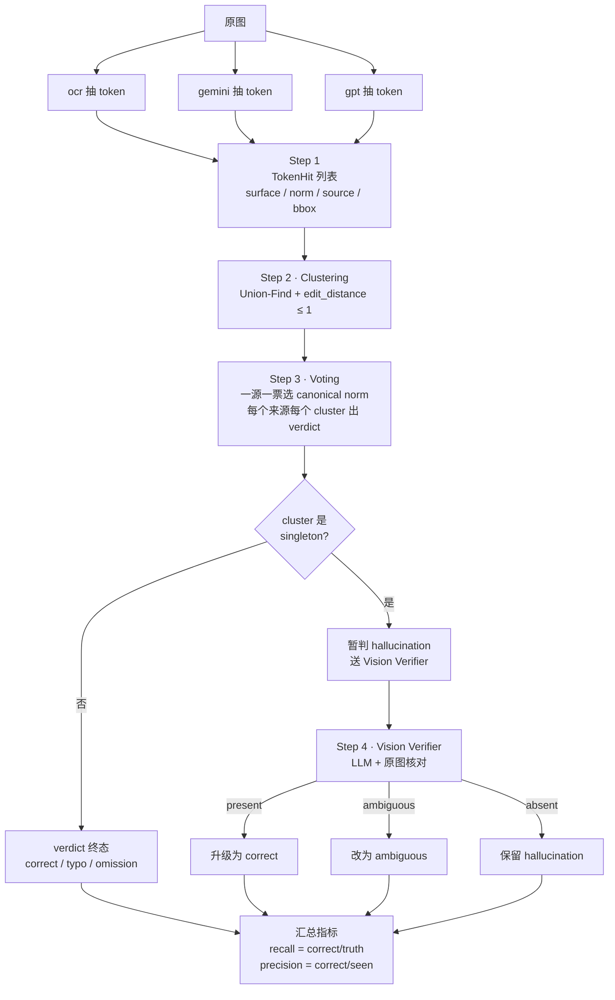

# 交叉验证逻辑详解（含完整例子）

本文用一张简化发票当案例，把 doceval 的 **交叉验证 kernel** 从原始 token 一路推到 `summary.md` 里的数字，每一步都给出对应代码位置和数据形态。

代码位置：
- 算法：[src/doceval/consensus/clustering.py](../src/doceval/consensus/clustering.py)、[src/doceval/consensus/voting.py](../src/doceval/consensus/voting.py)
- 视觉验证 agent：[src/doceval/agents/](../src/doceval/agents/)
- 汇总 / 公式：[src/doceval/reporting/summary.py](../src/doceval/reporting/summary.py)

---

## 例子设定

假设图上真正存在的内容是 2 段文本：

- 发票号 `INV-2024-9999`
- 单号 `5478`

三个来源各自读出来：

| 来源 | 读到什么 |
|---|---|
| **ocr** | `INV-2024-9999`, `5478` |
| **gemini** | `inv-2024-9999`, `5478` |
| **gpt** | `INV-2024-9999`, `5479` ← 数字差一位（typo）, `WATERMARK` ← 图上其实没有 |

期望系统给出的结论：

- 发票号 / 单号 → ocr & gemini & gpt 一起得分（其中 gpt 在单号上是「看错」）
- `WATERMARK` → 只有 gpt 一个见过 → 走视觉验证 → 视觉说"没有" → gpt 记一次「幻觉」

整体流程图：



---

## Step 1 · 抽 token（每来源独立干活）

每个 reader 把自己的输出切成 `TokenHit`，最关键是给每个 token 算一个 **`norm`**（标准化字符串）。规则大致是「转小写 + 去掉空格/标点/分隔符」。

| source | surface | **norm** | bbox |
|---|---|---|---|
| ocr | `INV-2024-9999` | `inv20249999` | `(120, 88, 310, 116)` |
| ocr | `5478` | `5478` | `(205, 410, 312, 438)` |
| gemini | `inv-2024-9999` | `inv20249999` | — |
| gemini | `5478` | `5478` | — |
| gpt | `INV-2024-9999` | `inv20249999` | — |
| gpt | `5479` | `5479` | — |
| gpt | `WATERMARK` | `watermark` | — |

> 设计要点：**所有比较都用 `norm` 不用 `surface`**。否则大小写、空格、`,`、`$` 这种格式差异会把同一个 token 拆开。`surface` 只用来在最终报告里展示给人看。
>
> 这一步**没有任何跨来源动作**，纯本地处理。

---

## Step 2 · 聚类（cluster）：把"指同一个东西"的 hit 合到一起

这一步要解决的问题：`"5478"` (ocr/gemini) 和 `"5479"` (gpt) 长得几乎一样，应该被认为是**同一个 token**，否则前者会算两个来源命中 + gpt 漏读，后者会算 gpt 幻觉——错得离谱。

### 算法（[clustering.py](../src/doceval/consensus/clustering.py)）

1. 取出**所有不同的 norm**，每个 norm 记下"哪些来源产生过它"：

   ```
   inv20249999 → {ocr, gemini, gpt}
   5478        → {ocr, gemini}
   5479        → {gpt}
   watermark   → {gpt}
   ```

2. 对每两个 norm 做以下检查，通过的就用 **Union-Find** 合并：
   - **必要条件 A**：`edit_distance(a, b) ≤ max_distance`（默认 1，即最多差一个字符）
   - **必要条件 B**：「a 和 b 至少有一个来源是另一边没有的」——也就是**不允许把同一来源内部的两个相似 norm 合并**（防止同一份合同里两个真不同的发票号被错合）

### 这步对例子的处理

| 配对 | edit_dist | 来源差异 | 合并？ |
|---|---|---|---|
| `inv20249999` 与其他 | ≫1 | — | 不合 |
| `5478` ↔ `5479` | 1 | {ocr,gemini} vs {gpt} 完全不同 | **合** ✅ |
| `5478` ↔ `watermark` | 大 | — | 不合 |
| `5479` ↔ `watermark` | 大 | — | 不合 |

合并完成后得到三个 cluster：

| Cluster | norms in it | sources present |
|---|---|---|
| **A** | `inv20249999` | {ocr, gemini, gpt} |
| **B** | `5478`, `5479` | {ocr, gemini, gpt} |
| **C** | `watermark` | {gpt} ← **singleton！** |

> 关键概念 ⚠️：**cluster ≠ 一个固定字符串**，而是"一组被认为指同一个东西的 hit"。Cluster B 里同时装着 `5478`（来自 ocr/gemini）和 `5479`（来自 gpt）—— 它们是同一个东西的不同写法。
>
> 是否 `singleton` 也是在这一步**自然决定**的：只有 1 个来源贡献了 hit 就是 singleton。这个标签直接决定第 4 步要不要走视觉验证。

---

## Step 3 · 投票：给每个 cluster 出一个 canonical，并给每个来源打 verdict

[voting.py](../src/doceval/consensus/voting.py) 干两件事。

### 3a. 选 canonical norm —— 一来源一票

对 cluster 内所有 hit，按 `(source, norm)` 去重，然后统计每个 norm 的"被多少个来源投过"。

**Cluster A**（`inv20249999`）：

| norm | 投票来源 | 票数 |
|---|---|---|
| `inv20249999` | ocr, gemini, gpt | **3** |

- `canonical_norm = inv20249999`
- `canonical_surface = "INV-2024-9999"`（优先 ocr，因为它见到像素）
- `bbox =` ocr 的方框

**Cluster B**（`5478` / `5479` 同一 cluster）：

| norm | 投票来源 | 票数 |
|---|---|---|
| `5478` | ocr, gemini | **2** |
| `5479` | gpt | 1 |

- `canonical_norm = 5478`（多数胜）
- `canonical_surface = "5478"`，bbox 来自 ocr

**Cluster C**（`watermark`，singleton）：

- 只有一种 norm
- `canonical_norm = watermark`，无 bbox（gpt 不产 bbox）

> 平票时（同票数有多个 norm 候选）按这个顺序破：① OCR 也见过的 norm ② 字符更长的 norm ③ 字典序。
>
> 为什么"一源一票"？防止某来源在一份文档里把同一 token 写了 10 遍就霸占整个投票。

### 3b. 给每个来源在每个 cluster 上打 verdict

对每个 cluster 遍历**所有来源**（注意：不只是 cluster 内的来源），按下表判定：

| 该来源在这个 cluster 里的状况 | verdict | 中文 |
|---|---|---|
| 有 hit 且 norm == canonical_norm | `correct` | 命中 |
| 有 hit 但 norm ≠ canonical_norm（编辑距离 ≤ 1，因为更远的不会被合进同一 cluster） | `typo` | 看错 |
| 没有 hit，且 cluster 不是 singleton（≥ 2 来源见过） | `omission` | 漏读 |
| 有 hit 但 cluster 是 singleton（只有自己一个看见） | `hallucination` *(暂判)* | 幻觉 |
| 没有 hit 且 cluster 是 singleton | **不打分** | — |

### 这步对例子的输出

| cluster | ocr | gemini | gpt |
|---|---|---|---|
| A `inv20249999` | correct | correct | correct |
| B `5478` (canonical) | correct | correct | **typo**（写成 `5479`，距离 1） |
| C `watermark` (singleton) | *(skip)* | *(skip)* | **hallucination** *(暂)* |

> ⚠️ 注意 cluster C 里 ocr 和 gemini **没有被算成 omission**。这是因为只有一个来源看到的东西不能反过来怪其他来源"漏读"。这条规则在 [voting.py · judge_cluster](../src/doceval/consensus/voting.py) 里写得很清楚：
>
> ```python
> if not hits:
>     if is_singleton:
>         continue   # ← 不发 omission
> ```

到这里**如果不开 vision verifier**，所有 verdict 就已经定了。剩下一步只服务于"减少误判幻觉"。

---

## Step 4 · Vision Verifier：救济 singleton

Cluster C 上 gpt 被暂判 `hallucination`。但有可能：

- gpt 真的胡说 → 应该保持 `hallucination`
- gpt 是唯一读对的（ocr 漏框、gemini 没识别）→ 应该升级成 `correct`
- 图上有个模糊的水印，看不太清 → 应该改成 `ambiguous`

判断它属于哪种，[`VisionVerifierAgent`](../src/doceval/agents/) 把原图 + 这串可疑文字（`"WATERMARK"`）一起发给一个**新的视觉 LLM**（默认 `gpt-5.4-2026-03-05`），让它在原图上找一下。

LLM 给一个结构化判断：

| 返回值 | 处理 | 最终 verdict |
|---|---|---|
| `present` | `apply_vision_verdict(visible=True)` | `hallucination` → **`correct`** |
| `ambiguous` | 直接改 verdict | **`ambiguous`** |
| `absent` | 保留原值 | **`hallucination`** |

假设这次 LLM 说 `absent`，那 gpt 的 `WATERMARK` 维持 `hallucination`。

> 为什么用一个**独立的**模型来仲裁？因为 gpt-MD 自己已经"作过案"，再让自己审自己没意义。换一个 vision 模型相当于多请一位陪审员。
>
> 这也是为什么 `Temp/summary.md` 第一行会标注 `视觉验证模型: gpt-5.4-2026-03-05`——这是验证用的模型，**不是**被评测的模型。

---

## 这套机制怎么变成 summary 里的数字

跑完四步后，每个来源在每个 cluster 上都恰好有 0 或 1 个 verdict。把所有 cluster 的 verdict 加总：

| source | correct | typo | omission | hallucination | ambiguous |
|---|---|---|---|---|---|
| ocr | 2 | 0 | 0 | 0 | 0 |
| gemini | 2 | 0 | 0 | 0 | 0 |
| gpt | 1 | 1 | 0 | 1 | 0 |

然后套公式（[summary.py](../src/doceval/reporting/summary.py)）：

```text
seen  = correct + typo + hallucination + ambiguous     ← 该来源写出多少
truth = correct + omission + typo                       ← 它本应写多少

recall    = correct / truth        precision = correct / seen
```

| source | seen | truth | recall | precision |
|---|---|---|---|---|
| ocr | 2 | 2 | 100% | 100% |
| gemini | 2 | 2 | 100% | 100% |
| gpt | 3 | 2 | **50%** | **33%** |

gpt 的 recall=50% 是因为 cluster B 它把 `5478` 写成 `5479`，被记 `typo`，分子 correct 只有 1，分母 truth = 1（correct）+ 1（typo） = 2。precision=33% 是因为 seen=3（包含那个 `WATERMARK` 幻觉）。

---

## 几个非常容易被绊倒的细节

1. **norm 的标准化规则决定一切**。如果 norm 把 `"5478"` 和 `"5,478"` 标成不同字符串，那金额这类 token 会无端制造大量 singleton 与幻觉。这套代码把空格、`,`、`$`、`-` 这类格式字符都去掉就是为了避开这个坑。
2. **`edit_distance ≤ 1` 是双刃**。它能救 `5478/5479` 这种 OCR/typo 场景，但**两个真不同**的单据号 `12345` 与 `12346` 也会被合并成一个 cluster——加大 corpus 时要关注。
3. **`omission` 不在 singleton 上算**。这条规则让"独家正确"被视觉模型救回时不会反过来把别人扣分；但反过来，如果视觉模型说 `present` 把 hallucination 改成 correct，**其他来源在那个 cluster 上仍然不打 omission**（参见 [voting.py · judge_cluster](../src/doceval/consensus/voting.py) 的早 return 分支）——这是个**已知**的"宽松"行为，避免错判其他来源。
4. **召回率分母含 typo**。也就是说"你看到但写错了"也算"你有机会写到的"。这个定义偏宽容（鼓励敢写），如果想要更严格的定义可以改成 `truth = correct + omission`。
5. **加 / 减一个来源会扰动所有人的分数**。因为 cluster 是否 singleton 取决于"几个来源见过"。所以单独换 `gpt-5.4-unoptimized` 这一列，gpt-5.4 / gpt-5.5 / gemini 的命中数字也会跟着轻微漂——不是 bug，是这个算法的本质特性。

---

## 一句话总结

> 每个来源把图变成一堆 **TokenHit** → 用 **edit_distance + Union-Find** 把"指同一个东西"的 hit 聚成 **cluster** → 每个 cluster **一源一票**选出 **canonical norm** → 给每个来源打 **verdict**（命中/看错/漏读/幻觉/不明确）→ singleton 送 **vision verifier** 二次核对 → 按 `correct / truth` 算**召回**、`correct / seen` 算**准确**。
